### MLO 3 Study Guide (work in progress)
#### Question 1:
	LongPower(int n, int x) {
	      long ans;
	      if(n==0) return  1;
	      else{
	            ans = Power (n/2, x) * Power (n/2, x);
	            if (n % 2 == 1) ans *= x;
	           return ans;
	
		}    
	}
#### Answer:  C)  T(n) = 2T(n/2) + O(1)
---
#### Question 2:
	T(n) = 1 if  n = 1 ,
	       n * T(n-1) if n>1 

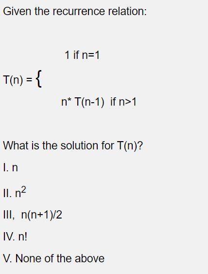

https://www.youtube.com/watch?v=icS-e8RaCyo

#### Answer: IV. n! 
---
#### Question 3:

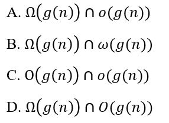

T(n) is O(f(n))" basically means that f(n) describes the upper bound for T(n)
T(n) is Ω(f(n))" basically means that f(n) describes the lower bound for T(n)
T(n) is Θ(f(n))" basically means that f(n) describes the exact bound for T(n)
T(n) is o(f(n))" basically means that f(n) is the upper bound for T(n) but that T(n) can never be equal to f(n)
Lowercase Omega and Theta are non-inclusive of the function they bound so Uppercase Omega(g(n) union lowercase o(g(n)) is empty

#### Answer:  A
---
#### Question 4:

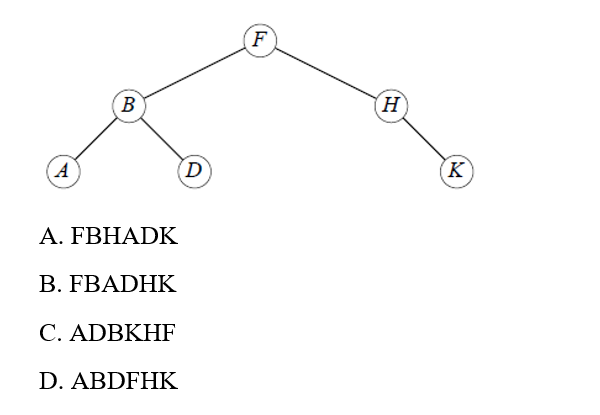

post-order: left->right->root

#### Answer:  C ADBKHF
---
#### Question 5:

From wiki:
> Quicksort is an efficient, general-purpose sorting algorithm. Quicksort was developed by British computer scientist Tony Hoare in 1959[1] and published in 1961.[2] It is still a commonly used algorithm for sorting. Overall, it is slightly faster than merge sort and heapsort for randomized data, particularly on larger distributions.[3]
> 
> Quicksort is a divide-and-conquer algorithm. It works by selecting a 'pivot' element from the array and partitioning the other elements into two sub-arrays, according to whether they are less than or greater than the pivot. For this reason, it is sometimes called partition-exchange sort.[4] The sub-arrays are then sorted recursively. This can be done in-place, requiring small additional amounts of memory to perform the sorting.
> 
> Quicksort is a comparison sort, meaning that it can sort items of any type for which a "less-than" relation (formally, a total order) is defined. Most implementations of quicksort are not stable, meaning that the relative order of equal sort items is not preserved.
> 
> Mathematical analysis of quicksort shows that, on average, the algorithm takes O ( n log ⁡ n ) O(n\log {n}) comparisons to sort n items. In the worst case, it makes O ( n 2 ) O(n^{2}) comparisons. 
> 
For Quick sort, which of the following is accurate?

False	A. The worst case and best case have the same order running time 
False	B. It always needs another same-sized array (extra space) to finish the sorting 
False	C. Two elements with the same value will always change their order after sorting 
True	D. The best case and average case have the same order running time 

#### Answer: D. The best case and average case have the same order running time
---
#### Question 6

	for (i=n/2; i <= n; i++)
	     for (j = 1; j <= n; j = j*2)
	               count++;

The complexity of the above computation is:

I.  O(n) 
II. O(log n ) 
III. O(log n)^2  
IV. O(n^2 log n) 
V. O(n log n) 

#### Answer: V. O(n log n) 
---
#### Question 7

> Consider the above "for" loops. If n is the size of input (positive), which function is most efficient(if the task to be performed is not an issue)?

A) for(i = 0; i < n; i++)  
B) for(i = 0; i < n; i += 2)  
C) for(i = 1; i < n; i *= 2)  
D) for(i = n; i > -1; i /= 2) 

#### Answer: C) for(i = 1; i < n; i *= 2)  
---
#### Question 8 

What is the asymptotic running time complexity of the algorithm as a function of n.
	i=1 
	while (i<= n) { 
                j=n;   //  
        	while (j>=1) {
                        // Something runs 
                   j=j/2 
                }
          i=i+1; 
        }
A: Ɵ (n) 
B:  Ɵ (logn) 
C: Ɵ (n logn) 
D: Ɵ (n2) 
E: Ɵ (log n2) 

#### Answer: C: Ɵ (n logn) 
---
#### Question 9 

Which of the following have the same order of growth? Choose ALL that apply:

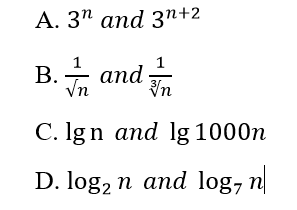

#### Answer: A, C, D
---
#### Question 10 

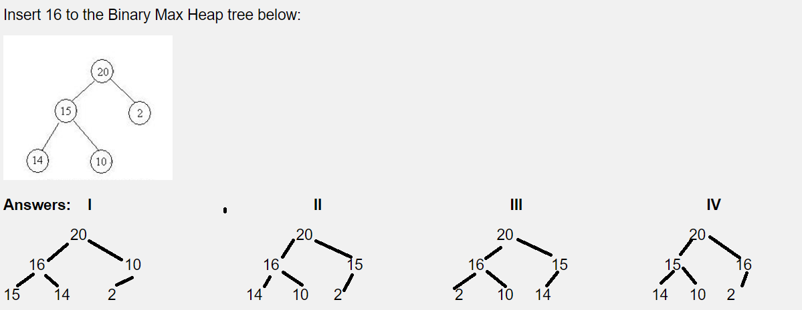

#### Answer: IV  
---
#### Question 11 

If a binary search tree is made with the following values: 9,4,7,8,12,2,6,3. What is the in-order traversal of the binary search tree?

	A) 12,9,8,7,6,4,3,2
	B)  12,6,4,7,2,9,3,8
	C) 2,3,4,6,7,8,9,12
	D) 9,7,8,12,6,3,4,2
	E) None of the above

#### Answer: C
---
#### Question 12 

Consider the same Binary Search Tree

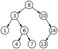

What is the order in which the nodes are visited using BFS and DFS algorithms.

	A) BFS: 8,3,10,1,6,14,4,7,13 DFS:1,3,4,6,7,8,10,13,14
	B) BFS: 4,7,13,1,6,14,3,10,8 DFS:8,3,1,6,4,7,10,14,13
	C) BFS: 4,7,13,1,6,14,3,10,8 DFS:1,3,4,6,7,8,10,13,14
	D) BFS: 8,3,10,1,6,14,4,7,13 DFS:8,3,1,6,4,7,10,14,13
	E) None of the above are correct
See these examples:

<a href="https://github.com/Shramster/MLO3_StudyGuide/blob/main/examples/Question_12_BFS.py"> ./examples/Question_12_BFS.py </a>

<a href="https://github.com/Shramster/MLO3_StudyGuide/blob/main/examples/Question_12_DFS.py"> ./examples/Question_12_DFS.py </a>

#### Answer: D
--- 
#### Question 13

Which of the following is NOT a MAX Heap tree?

A: No  
B: No  
C: No 
D: No 
E: NO  
F: Yes  
#### Answer: F , None of the Above 
--- 
#### Question 14

> Suppose that we have numbers between 1 and 1000 in a binary search tree, and we want to search for the number 363. Which of the following sequences could not be the sequence of nodes examined?

	A) 2, 252, 401, 398, 330, 344, 399, 363
	B) 924, 220, 911, 244, 898, 258, 362, 363
	C) 925, 202, 911, 240, 909, 245, 363
	D) 2, 399, 387, 219, 266, 382, 381, 278, 363
	E)  202, 399, 387, 219, 266, 382, 381, 278, 363

A) 2 -> (right 252) -> (right 401) -> (left 398) -> (left 330) -> (right 344) -> ***(right 399)!!*** -> 363 
all left children of 398 must be less than 398----------------------------------------^^^^^^

#### Answer: A 
--- 
#### Question 15

Any random element from the given Binary Search Tree is to be searched using the standard algorithm. In the Binary Search Tree given in the above problem

(i) Determine the average or expected number of comparisons required to locate the element.  

(ii) determine the number of comparisons in the worst case.

2.8 and 3.5 
2 and 3 
2.89 and 4 
2,89 and 3 
2 and 4 

#### Answer: 2.89 and 4 
--- 
#### Question 16

Delete the minimum element in the Min Binary Heap Tree given below:

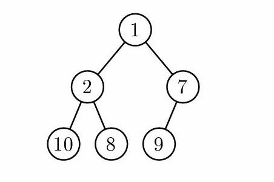

Answers:

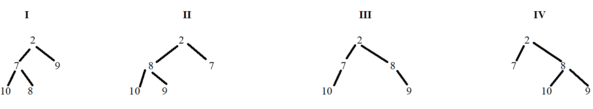

#### Answer: II
---
#### Question 17 

In what order would the vertices in the graph be visited using DFS algorithm (ASSUME that the neighbors of a vertex are visited in alphabetical order)

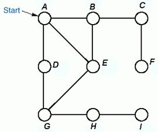

	A) DFS: ABCFDGHIE BFS: ABCDEFGHI
	B) DFS: ABCFEGDHI BFS: ABDECGFHI
	C) DFS: ADGBEHCFI BFS: ABCEFDGHI
	D) DFS: ADGBEHCFI BFS: ABDECGFHI
	E) None of the above

See these examples:

<a href="https://github.com/Shramster/MLO3_StudyGuide/blob/main/examples/Question_17_BFS.py"> ./examples/Question_17_BFS.py </a>

<a href="https://github.com/Shramster/MLO3_StudyGuide/blob/main/examples/Question_17_DFS.py"> ./examples/Question_17_BFS.py </a>

	[shram@latty ~/MLO3/Answers/examples]$ python Question_17_BFS.py
	BFS:
	A B D E C G F H I %
	[shram@latty ~/MLO3/Answers/examples]$ python Question_17_DFS.py
	DFS:
	A B C F D G H I E %

#### Answer: E

---

#### Question 18

Given that V is a two- dimensional matrix of 20 rows and 15 columns. The first element is referred to as V[0,0]. The matrix is stored in row major form where every array element occupies 2 bytes. If the starting address where V is stored is “x”, what is the address where V[15,12] is located.

	A) x+324
	B) x+384
	C) x+444
	D) x+474
	E) x+624

	15 * 15 + 12 = 237 entries
	237 * 2 bytes = 474 byte offset

<--- 15 col ---->
^
|
20 rows
|	V[15,12]
^

15 * 15

#### Answer: D

---

#### Question 19

Let G=(V,E) be a graph. Let |V|=n and |E|=e. 

What is the complexity of BFS (breadth first search) as a function of n and e?

	A)  O( n * e )
	B)  O( n + e )
	C)  O( n log( e ) )
	D)  O( n^2 e )
	E) None of the above

#### Answer: B 

---

#### Question 20

Consider a possible divide and conquer approach to finding a minimal spanning tree in a connected, weighted graph G.

Suppose that we divide the vertices of G into two disjoint subsets V1 and V2. We then find a minimal spanning tree T1 for V1 and a minimal spanning tree T2 for V2. Finally we find a minimum weight edge e connecting T1 and T2. We let T be the graph obtained by combining T1, T2 and e.

 
	A) T is always a spanning tree but not necessarily minimal
	B) T is always a minimal spanning tree
	C) T is not necessarily a spanning tree
	D) T is the only minimal spanning tree that contains e

#### Answer: A (not sure)

---
#### Question 21

Which of the following is a correct ordering, from best to worst of algorithm speeds?

	A) Linear, Exponential, Polynomial, Logarithmic
	B) Logarithmic, Linear, Polynomial, Exponential
	C) Exponential, Polynomial, Linear, Logarithmic
	D) Logarithmic, Exponential, Linear, Polynomial
	E) Logarithmic, Linear, Exponential, Polynomial

#### Answer: B
---

#### Question 22

Given the following three statements:

I. n(n+1)/2 belongs to O(n) 
II. n(n+1)/2 belongs to ϴ(n) 
III.   n(n+1)/2 belongs to Ω(n) 
I, II, and III are respectively 

	A. True, True, False
	B. False, False, False
	C. False, False, True
	D. Ture, False, False
	E. False, True, True

	n(n-1)/2 = (n^2 - n)/ 2
#### Answer: C 
---

#### Question 23

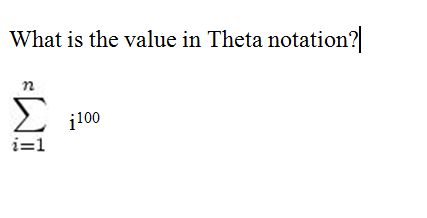

	A.    Ɵ (n100)
	B.    Ɵ (n101)
	C.    Ɵ (n99)
	D.    Ɵ (n100log n)
	E.    Ɵ (n100 log 100)

#### Answer: B.    Ɵ (n101)
---
#### Question 24

What is the asymptotic running time complexity of the algorithms as a function of n.

Algorithm A:

	n = 10
	j=n j = 10
	  while (j >= 1) { log ( n ) times
	    i=j; i = 2
	    while (i<= n) { i= 5 <=  n = 10 
	       // Something
	       i=i+1; 1 time 6 times 8 times 9 times linear times
	    }
	    j=j/2 j = 10 , 5 , 2, 1, 0
	  }

	n log n 

Algorithm B:

	n = 10
	i=1 
	    while (i<= n) {
	        j=n;    j=10
		while (j>=1) {
	     	   // Something
	     	   	j=j/2 4 times log(n) times
	     	}
	        i=i+1; i = 2 linear times 
	     }

 

	I. Algorithm A: Ɵ(n logn) Algorithm B: Ɵ (n^2)
	II. Algorithm A: Ɵ(n logn) Algorithm B: Ɵ;(n logn) 
	III. Algorithm A: Ɵ(n^2) Algorithm B: Ɵ (n^2)
	IV. Algorithm A:Ɵ;(n^2) Algorithm B: Ɵ(n logn)

 
#### Answer:  II. Algorithm A: Ɵ(n logn) Algorithm B: Ɵ;(n logn) 
---
#### Question 25

Establish how many times statement x = 2* x is executed in the asymptotic sense:

	   n=10
	   j = n; x = 1; DEBUG j = 10
	   while ( j >= 1 ) {  log(n)
	      for ( i = 1; i <= 2*n; i++ ) 20 times 2 * n times
	         x = 2 * x;
	      j = j / 2; j = 5 
	   }
 
A) Theta( n^2 / 2 ) 
B) Theta( n^2 log( n )^2 ) 
C) Theta( n^2 log( n ) ) 
D) Theta( n log (n ) ) 
E) Theta( n ) 

#### Answer:  D) Theta( n log (n ) )
---
#### Question 26
	n(n+1)/2 belongs to Theta(n3)
	
	True
	False

	n(n+1)/2 = (n^2 + 2) / 2
	Not a tight bound
#### Answer: False 
---
#### Question 27

A Tree is a graph that is not necessarily connected but has no cycles
Group of answer choices
True
False

#### Answer:  False	
---
#### Question 28

The following is in increasing order of growth:

	O(1)< O(n) < O(log n) <O(n * log n) < O(n2) < O(n3) < O(2n)

#### Answer: False 
---
#### Question 29

> Banks often record transactions on an account in order of the times of the transactions, but many people like to receive their bank statements with checks listed in order by check number. People usually write checks in order by check number, and merchants usually cash them with reasonable dispatch. The problem of converting time-of-transaction ordering to check-number ordering is therefore the problem of sorting almost-sorted input. What sorting algorithm would work best for this case?

A. Insertion sort algorithm 
B. Merge-Sort algorithm 
C.  Heap-Sort algorithm 
D. Quick-Sort algorithm 
E. Counting-Sort algorithm 

#### Answer: A. Insertion sort algorithm 

---

#### Question 30 

The formal approach to determining the big-O complexity of an algorithm is to set up recurrence relations and solve them.

The recurrence relation for the Linear Search algorithm is defined by:

I. T(n)=T(n-1)+1 
II. T(n) = 2T(n/2)+1 
III. T(n)=T(n-1)+Theta(n) 
IV. T(n)=2T(n/2)+Theta(n) 
V. None of the above 

#### Answer: I. T(n)=T(n-1)+1 
---

#### Question 31

The total number of comparisons in bubble sort is

I.  O(n) 
II. O(log n ) 
III. O(n^2) 
IV. O(n log n) 
V. None of the above 
 
#### Answer: III. O(n^2) 

---

#### Question 32

The recurrence relation for the Merge Sort algorithm is defined by:

I. T(n)=T(n-1)+1 
II. T(n) = 2T(n/2)+1 
III. T(n)=T(n-1)+Theta(n) 
IV. T(n)=2T(n/2)+Theta(n) 
V. None of the above  
#### Answer: IV. T(n)=2T(n/2)+Theta(n) 
---
#### Question 33

The sorting algorithm that proceeds by finding the smallest (or largest, depending on sorting order) element in the unsorted sublist, exchanging it with the leftmost unsorted element (putting it in sorted order), and moving the sublist boundaries one element to the right.

I. Selection Sort 
II. Bubble Sort 
III. Merge Sort 
IV. Quick Sort 
V. Insertion Sort 
#### Answer: I. Selection Sort 
---
#### Question 34

The complexity of Binary search algorithm is

I.  O(n) 
II. O(log n ) 
III. O(n^2) 
IV. O(n log n) 

#### Answer: II. O(log n ) 
---
#### Question 35

The hash function is used to insert the keys  61, 62, 63, 64, and 65  into a hash table of size m = 1000.    

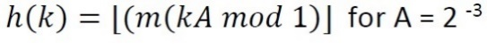

The order of the hash codes in the table are given by

	A. 625, 125, 0, 750, 875
	B. 625, 750, 625, 125, 0
	C. 625,125, 0, 875, 750
	D. 625, 750, 875, 0, 125
	E. 625, 750, 125, 875, 0

#### Answer: D. 625, 750, 875, 0, 125
---
#### Question 36

Suppose we need to write an efficient program to store N employee records for ABC Inc where each employee record is identified by unique employee id. Consider the following ways to store the records.

    An array list sorted by employee id
    A linked list sorted by employee id
    A linked list not sorted
    A balanced binary search tree with employee id as key

For data structure above in 1 -4, what is the average time to insert a new employee record given employee id as a key?

A.  O(log N), O(log N), O(N), O(1) 
B. O(log N), O(N), O(N), O(log N) 
C. O(N), O(log N), O(N), O(1) 
D.  O(log N), O(log N), O(N), O(log N) 
E. O(N), O(N), O(1), O(log N) 

#### Answer: E. O(N), O(N), O(1), O(log N) 
---
#### Question 37

Consider the recurrence equation 
	T(n) = 2T(n-1), if n>0
		= 1, otherwise

Then T(n) is 

A) Θ(n2) 
B) Θ(n2 log n) 
C) Θ(2^n) 
D) Θ(n!) 
E) Θ(n log n) 

#### Answer: C) Θ(2^n) 
---
#### Question 38

Which of the following is the solution using the Master Theorem for the recurrence relation

T(n)=4T(n/2) + log n

 
A) Θ(n2) 
B) Θ(n2 log n) 
C) Θ(2n) 
D) Θ(n!) 
E) Θ(n log n) 

#### Answer: 
---
#### Question 39 1 pts

Which of the following is the solution using the Master Theorem for the recurrence relation

T(n)=16T(n/4) + n

A) Θ(n2) 
B) Θ(n2 log n) 
C) Θ(2n) 
D) Θ(n!) 
E) Θ(n log n) 

#### Answer: A) Θ(n2) 
---
#### Question 40

Which of the following is the solution using the Master Theorem for the recurrence relation

T(n)=4T(n/2) + n^2

A) Θ(n2) 
B) Θ(n2 log n) 
C) Θ(2n) 
D) Θ(n!) 
E) Θ(n log n) 

#### Answer: B) Θ(n2 log n) 
---
#### Question 41

Which of the following is the solution using the Master Theorem for the recurrence relation

T(n)=3T(n/2) + n2

A) Θ(n2) 
B) Θ(n2 log n) 
C) Θ(2n) 
D) Θ(n!) 
E) Θ(n log n) 

#### Answer: A) Θ(n2) 

---

#### Question 42

What is the minimum possible weight of the spanning tree 

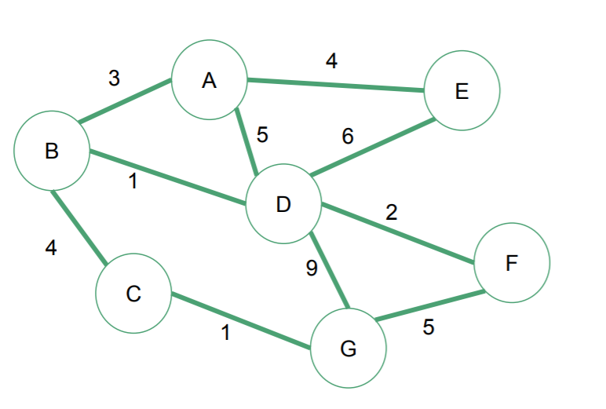

G < - > C 1
B < - > C 4
B < - > D 1
D < - > F 2
B < - > A 3
A < - > E 4

A) 25 
B) 15 
C) 20 
D) 12 
E) 16 

#### Answer: B) 15 
---
#### Question 43

Which of the above graphs can be categorized as a tree?

#### Answer: Graph 1 and Graph 3
---

#### Question 44

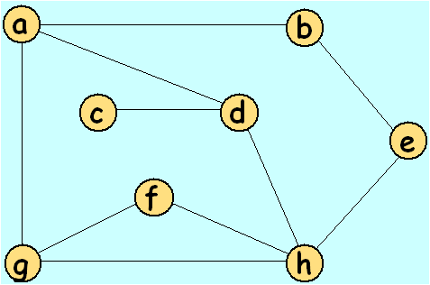

In what order the vertices of the graph are visited in depth-first search that starts at vertex b

(Assume that the neighbors of a vertex are visited in alphabetical order)

 
I)  b, a, d, c, e, h, f, g 
II)  b, a, d, c, h, e, f, g 
III) b, a, e, d, g, c, f, h 
IV)  b, a , d, e, c, f, g, h 
V) None of the above 
#### Answer: I got badchfge V) None of the above  
---
#### Question 45

Consider the MAX HEAP below:

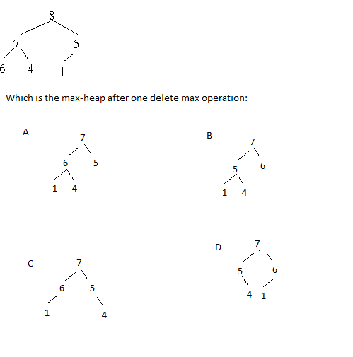

#### Answer:  A
---
#### Question 46

What is the Postorder Traversal of the following tree

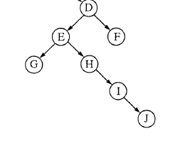

 

I)  F, J, I, H, G, E, D 
II) G, H, I, J, E, D, F 
III)  D, F, E, H, I, J, G 
IV)  D, E, G, H, I, J, F 
V)  G, J, I, H, E, F, D 

#### Answer: 
---
#### Question 47
Sort an array in ascending order using Merge sort. The best case (array is already sorted in ascending order) takes  as many iterations/Comparisons as its worst case (array is sorted in descending order)  

T / F ?

#### Answer: 
---
#### Question 48

With 1000 elements,  the maximum height of the max-heap tree is 10

(Tree height: the  longest path from the root node to a leaf node.  )  

T / F ?
#### Answer: 
---
#### Question 49
f(n)=O(g(n)) if and only if g(n)=O(f(n)) 

T / F ?

#### Answer: 
---

#### Question 50
The solution of T(n) = T(n - 2) + n is Theta(n2)                

T / F ?

#### Answer: 
---
